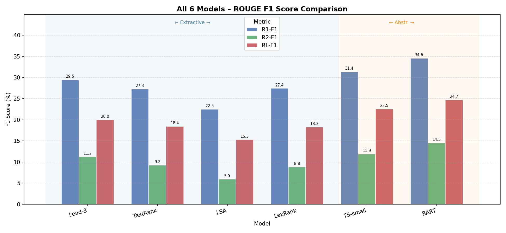
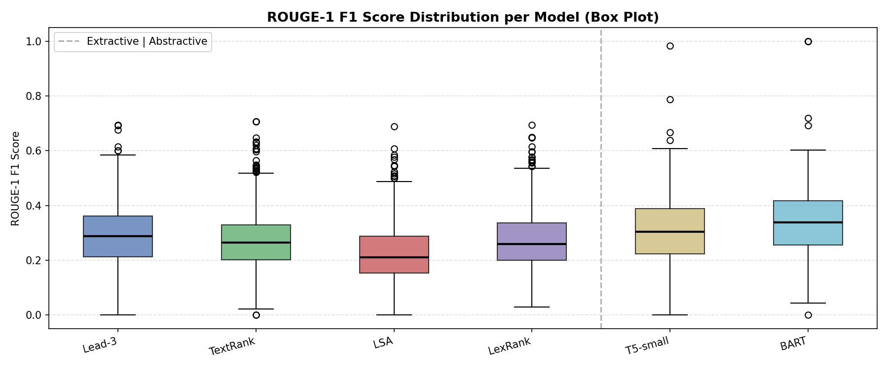
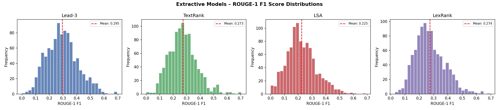
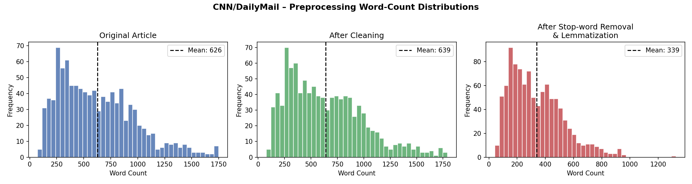

# NLP Text Summarization — Comparative Study


A comparative analysis of **6 text summarization models** — 4 extractive and 2 abstractive — evaluated on the CNN/DailyMail 3.0.0 benchmark with full ROUGE-1/2/L scoring.

> M.Tech NLP — CA-3 Mini Project

---

## Overview

This project implements and compares six summarization approaches:

| # | Model | Type | Approach |
|---|-------|------|----------|
| 1 | Lead-3 | Extractive | First 3 sentences (baseline) |
| 2 | TextRank | Extractive | TF-IDF → cosine similarity graph → PageRank |
| 3 | LSA | Extractive | TF-IDF → TruncatedSVD → L2 norm scoring |
| 4 | LexRank | Extractive | IDF-weighted cosine → stochastic graph → PageRank |
| 5 | T5-small | Abstractive | `t5-small`, beam search, ~240 MB |
| 6 | BART-large-cnn | Abstractive | `facebook/bart-large-cnn`, fine-tuned on CNN/DM, ~1.6 GB |

---

## Results

### ROUGE Scores

| Model | Type | R1-Prec | R1-Rec | R1-F1 | R2-F1 | RL-F1 |
|-------|------|---------|--------|-------|-------|-------|
| Lead-3 | Extractive | 22.72% | 46.84% | 29.47% | 11.21% | 19.96% |
| TextRank | Extractive | 20.74% | 44.57% | 27.28% | 9.24% | 18.42% |
| LSA | Extractive | 19.54% | 30.45% | 22.50% | 5.91% | 15.28% |
| LexRank | Extractive | 21.49% | 42.29% | 27.42% | 8.80% | 18.28% |
| T5-small | Abstractive | 29.31% | 35.35% | 31.38% | 11.90% | 22.53% |
| **BART** | **Abstractive** | **29.06%** | **44.90%** | **34.55%** | **14.51%** | **24.69%** |

> Extractive models: 1,000 test samples · Abstractive models: 200 test samples

**Key findings:**
- BART is the best overall model, winning against Lead-3 on **69%** of individual samples
- Abstractive models outperform extractive by **6.30%** on average ROUGE-1 F1
- Lead-3 beats TextRank, LSA, and LexRank due to CNN/DailyMail's inverted-pyramid writing style
- T5-small outperforms Lead-3 despite not being fine-tuned on this dataset

### ROUGE F1 Comparison


### ROUGE-1 F1 Distribution


### Extractive Model Distributions


### Preprocessing Word Count


---

## Dataset

[CNN/DailyMail 3.0.0](https://huggingface.co/datasets/ccdv/cnn_dailymail) — ~300k English news articles with human-written reference summaries (`highlights`).

| Split | Samples Used |
|-------|-------------|
| Extractive evaluation | 1,000 test samples |
| Abstractive evaluation | 200 test samples |

---

## Preprocessing Pipeline

| Step | Operation | Tool |
|------|-----------|------|
| 1 | HTML cleaning, CNN byline removal | `re` |
| 2 | Sentence tokenization | `nltk.sent_tokenize` |
| 3 | Word tokenization | `nltk.word_tokenize` |
| 4 | Stop-word removal | `nltk.corpus.stopwords` |
| 5 | Lowercase + lemmatization | `WordNetLemmatizer` |

Average word count reduced from **626.3 → 339.4** (45.8% reduction).

---

## Project Structure

```
NLP-Text-Summarization/
├── 1_preprocessing.py        # Cleaning, tokenization, stopword removal, lemmatization
├── 2_extractive_models.py    # Lead-3 | TextRank | LSA | LexRank
├── 3_abstractive_models.py   # T5-small | BART-large-cnn
├── 4_evaluation.py           # ROUGE comparison, bar chart, box plot, win-rate
├── 5_demo.py                 # Interactive CLI demo (all 6 models)
├── requirements.txt
├── .gitignore
└── outputs/
    ├── rouge_comparison.png
    ├── rouge_boxplot.png
    ├── extractive_distributions.png
    ├── preprocessing_wordcount.png
    ├── model_comparison.csv
    └── win_rate.csv
```

> **Note:** `.pkl` files are excluded via `.gitignore` (too large). Run the scripts in order to regenerate them.

---

## Setup

```bash
git clone https://github.com/Chauhanjay0912/NLP-Text-Summarization.git
cd NLP-Text-Summarization
pip install -r requirements.txt
```

NLTK data downloads automatically on first run.

---

## How to Run

```bash
# Step 1 — Preprocessing
python 1_preprocessing.py

# Step 2 — Extractive models (Lead-3, TextRank, LSA, LexRank)
python 2_extractive_models.py

# Step 3 — Abstractive models (downloads T5 ~240MB + BART ~1.6GB on first run)
python 3_abstractive_models.py

# Step 4 — Full evaluation & plots
python 4_evaluation.py

# Step 5 — Interactive demo
python 5_demo.py
```

---

## Interactive Demo

`5_demo.py` lets you summarize any article from the command line:

```
[1] Paste your own article
[2] Use built-in sample (TRAPPIST-1 exoplanet article)
[Q] Quit

Select models: 1=Lead-3  2=TextRank  3=LSA  4=LexRank  5=T5  6=BART
Optionally provide a reference summary to get live ROUGE scores.
```

---

## References

- Lewis et al. (2020). BART. *ACL 2020.*
- Raffel et al. (2020). T5. *JMLR.*
- Erkan & Radev (2004). LexRank. *JAIR.*
- Mihalcea & Tarau (2004). TextRank. *EMNLP.*
- Gong & Liu (2001). LSA Summarization. *SIGIR.*
- Lin (2004). ROUGE. *ACL Workshop.*
- [CNN/DailyMail Dataset](https://huggingface.co/datasets/ccdv/cnn_dailymail)
